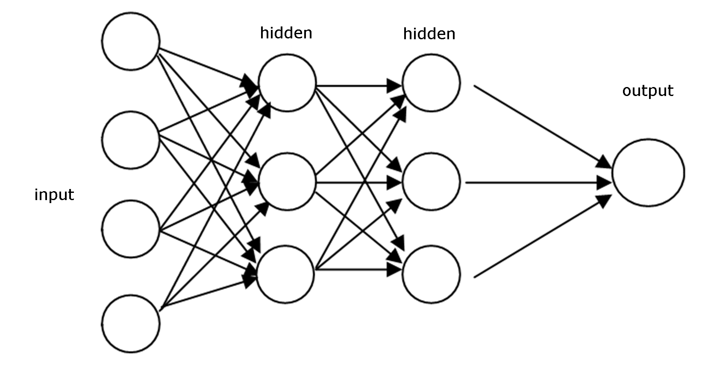

# PredictTrafficOfServer

[Link contest](https://www.aivivn.com/contests/4)

- Using FNN - Feed Forward Neural Network (LR/GBR): public score: 79.71 - private score: 79.52
- Using FB Prophet: Fail

### 1. FNN Architecture:
With this content, I using simple FNN with 2 hidden layer. 
- Layer 1: 1024 node
- Layer 2: 512 node
- Output: 1 node

FNN Architecture

### 2. Read data

### 3. Preprocessing data and make feature:
Input of FNN have 10 feature as below:
- HOUR_ID:
- ZONE_CODE: with Label Encoder
- DayOfWeek: Day of week
- DayOfMonth: Day of month
- DayOfYear: Day of year
- Before2Month: Data collected from the last 2 months
- Before1Month: Data collected from the last previous months
- Before3Week: Data collected from the last 3 weeks
- Before2Week: Data collected from the last 2 weeks
- Before1Week: Data collected from the last week

### 4. Predict
- Because we must predict 1 month for every server. This is long time.
- We will predict 1 week in future. When we have result, we will concat with input data to make input feature for predict next week.

### 5. Output & Trick
Metric of this contest is MAPE:

So, when truth label At is so small, we maybe get MAPE that is so high. To avoid this case, when value of predict so small we set equal 0.